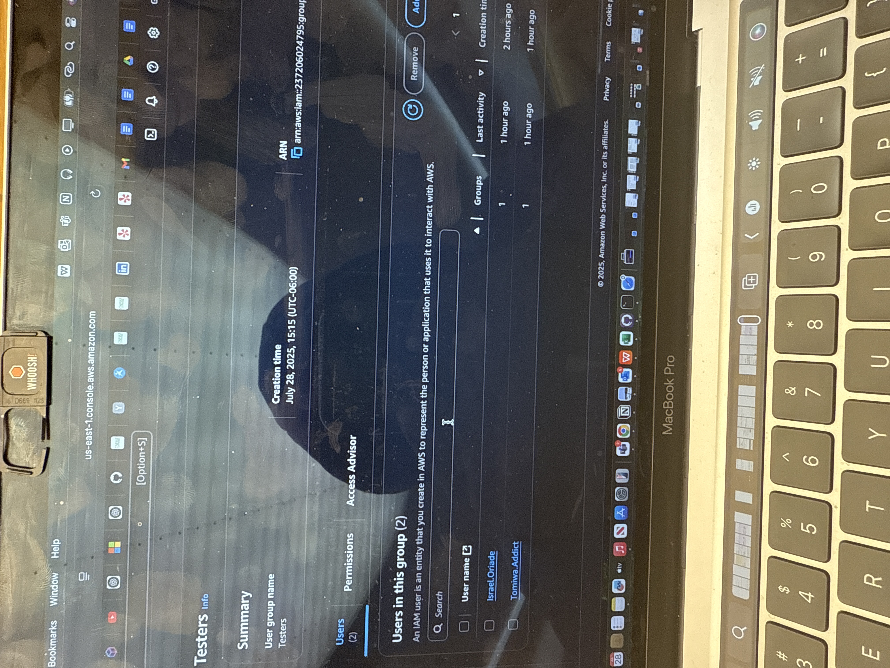

<<<<<<< HEAD
# Beginner IAM Project – AWS IAM Group Policy with Least Privilege Enforcement

✅ Created a group called "Testers"  
✅ Attached the AmazonS3ReadOnlyAccess policy  
✅ Tested with two users to verify read-only S3 access  
✅ Verified policy blocks upload/delete actions  

**Tech Used:** AWS IAM, S3, Managed Policies  
**Skills:** Identity-based access control, Least Privilege, IAM Group Permissions  

# IAM Group Policy Assignment & Least Privilege Enforcement
=======
# 🛡️ AWS IAM Policy Test Project
>>>>>>> 65a4388 (Updated README with screenshot table and added images)

## 📌 Project Overview
This project demonstrates how to assign group-based permissions using IAM policies and verify **Least Privilege** through hands-on testing.  
The goal was to ensure IAM users only perform actions they’re explicitly allowed to—nothing more, nothing less.

---

## 🛠️ What I Did
1. Created a group named `Testers`.
2. Attached the managed policy `AmazonS3ReadOnlyAccess`.
3. Added IAM users (`Tomiwa.Addict`, `Israel.Grade`) to the group.
4. Logged in as each user and tested access to Amazon S3:
   - ✅ Able to **view and list S3 buckets**
   - ❌ Unable to **upload or delete files**

---

## 🧪 Test Results

| Action Tested                  | Result        | Screenshot |
|-------------------------------|---------------|------------|
| View S3 Buckets               | ✅ Success     | [📸 View Screenshot](./screenshots/s3-readonly-access.png) |
| Upload/Delete Files           | ❌ Denied      | [📸 View Screenshot](./screenshots/s3-access-denied01.png) |
| IAM Group Creation            | ✅ Done        | [📸 View Screenshot](./screenshots/s3-user-groups01.png) |
| IAM User Listing              | ✅ Done        | [📸 View Screenshot](./screenshots/s3-users.JPEG) |
| Bucket Test File              | ✅ Visible     | [📸 View Screenshot](./screenshots/s3-testfile.png) |
| S3 Bucket Itself              | ✅ Accessible  | [📸 View Screenshot](./screenshots/s3-bucket.png) |

---

## 🖼️ Screenshot Previews

Below are direct clickable thumbnail previews of key screenshots:

| Action | Preview |
|--------|---------|
| IAM Group Setup |  |
| S3 Bucket Access |  |
| Read-Only Access |  |
| Access Denied (Upload) |  |
| Users in Group |  |
| Test File View |  |

---

## 🧰 Tools & Services Used
- AWS IAM (Users, Groups, Policies)
- Amazon S3 (for access testing)
- AWS Console
- IAM Managed Policy: `AmazonS3ReadOnlyAccess`

---

## 🔐 Security Concepts Practiced
- IAM Group-based permission assignment  
- Managed policy attachment  
- Access testing (allowed vs denied)  
- **Principle of Least Privilege**  
- Identity-based access control (IBAC)

---

## 📁 Project Structure

aws-iam-policy-test/
├── README.md
├── screenshots/
│ ├── s3-access-denied01.png
│ ├── s3-bucket.png
│ ├── s3-readonly-access.png
│ ├── s3-testfile.png
│ ├── s3-user-groups01.png
│ └── s3-users.JPEG

---

✅ **This project highlights my practical understanding of IAM security controls and least privilege enforcement in AWS.**
